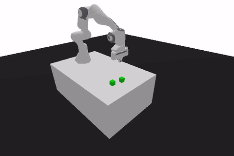

# Panda Push Reinforcement Learning

PPO and SAC implementations for the PandaPush-v3 environment, including uniform and adaptive domain randomization experiments.

This repository was developed as a university project to study reinforcement learning methods through practical implementation and evaluation.



## Setup

```bash
uv sync
```

## Usage

```bash
uv run python Panda_Push-PPO/main.py
uv run python Panda_Push-SAC/main.py
uv run python Panda_Push-SAC-UDR/main.py
uv run python Panda_Push-SAC-ADR/main.py
```

## Experimental Results

### PPO vs SAC (Nominal Environment)
- **SAC + HER**: Reaches near 100% success rate, showing high sample efficiency (trained for $2 \times 10^6$ steps).
- **PPO**: Underperforms, ending close to a 20% success rate even with shaped rewards (trained for $20 \times 10^6$ steps).

### Domain Randomization (Target Domain Evaluation at $m = 5.0$ kg)
To address the reality gap, we tested the models on a shifted target mass of $5.0\text{ kg}$ (nominal is $1.0\text{ kg}$) over 100 deterministic episodes:

| Model | Success Rate | Mean Reward |
| :--- | :---: | :---: |
| **SAC (Nominal)** | 86% | -40.45 |
| **SAC + UDR** | 98% | -12.72 |
| **SAC + ADR** | **100%** | **-8.39** |

Automatic Domain Randomization (ADR) expands the randomization range via an adaptive curriculum, resulting in perfect transfer performance.

